Benchmark Functions
===================

This page documents the benchmark tests used to validate the BOAR optimization framework.
Two classic optimization test functions are used: **Ackley** and **Rosenbrock**.

.. contents::
   :local:

Ackley Function
---------------

The Ackley function is a non-convex function commonly used to test optimization algorithms.
It has many local minima but one global minimum.

Function Definition
~~~~~~~~~~~~~~~~~~~

.. math::

    f(x, y) = -20 \exp\left(-0.2 \sqrt{\frac{x^2 + y^2}{2}}\right) - \exp\left(\frac{\cos(2\pi x) + \cos(2\pi y)}{2}\right) + e + 20

Properties
~~~~~~~~~~

+--------------------+----------------------------------+
| Property           | Value                            |
+====================+==================================+
| Global Minimum     | 0 at (0, 0)                      |
+--------------------+----------------------------------+
| Search Domain      | [-32.768, 32.768]                |
+--------------------+----------------------------------+
| Difficulty         | Multi-modal, many local minima   |
+--------------------+----------------------------------+

Optimization configurations (Ackley)
~~~~~~~~~~~~~~~~~~~~~~~~~~~~~~~~~~~~

.. code-block:: yaml

    optimization_variable_options:
      'bounds': [!!python/tuple [-32.768, 32.768]]
      'precision': None
      'n_initial': 15

    surrogate_model_options:
      'max_tested_vectors': 100
      'tolerance': 1e-6
      'GPR_iterations': 500
      'test_population': 100000

    sampling_options:
      'seed': 9

Benchmark Results
~~~~~~~~~~~~~~~~~

.. figure:: _static/images/ackley_benchmark/ackley_contour.svg
   :width: 600
   :alt: Ackley function contour plot

   **Figure 1:** Contour plot of the 2D Ackley function showing global minimum at center.

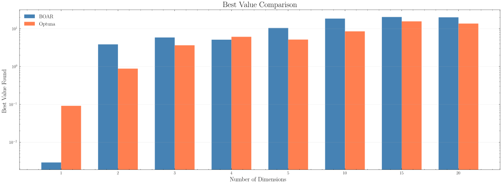

   **Figure 2:** Comparison of available BOAR optimization results on the Ackley function.

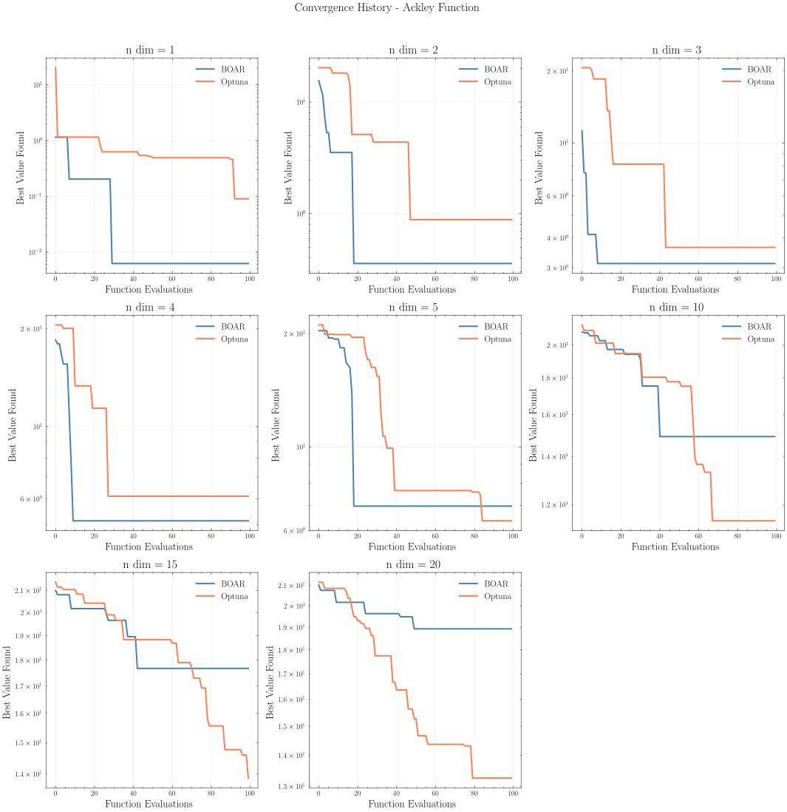

   **Figure 3:** BOAR optimization convergence on the Ackley function.

.. figure:: _static/images/ackley_benchmark/ackley_search_history.svg
   :width: 600
   :alt: Ackley search history

   **Figure 4:** Search history of BOAR optimization on the 2D Ackley function.

Constrained version
~~~~~~~~~~~~~~~~~~~

The Ackley function can also be tested with constraints, such as limiting the search space to a specific region or adding inequality constraints.
In this test case, we defined the following constraint:

.. math::

    g(x, y) = x_i + x_{i+1} + \ldots + x_n \leq 0

This constraint limits the sum of the optimization variables, creating a more challenging optimization problem.

Constrained Benchmark Results
~~~~~~~~~~~~~~~~~~~~~~~~~~~~~

.. figure:: _static/images/ackley_constrained/ackley_constrained_contour.svg
   :width: 600
   :alt: Ackley function contour plot with constraints

   **Figure 5:** Contour plot of the 2D constrained Ackley function showing feasible region.

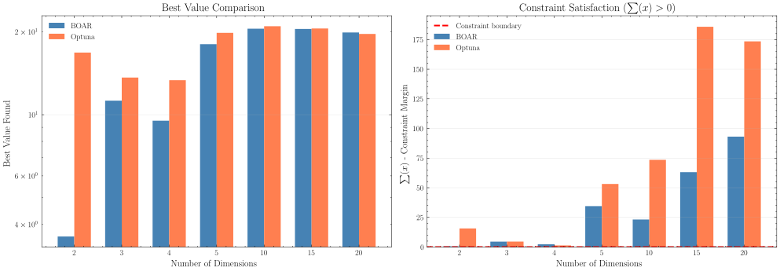

   **Figure 6:** Comparison of available BOAR optimization results on the constrained Ackley function.

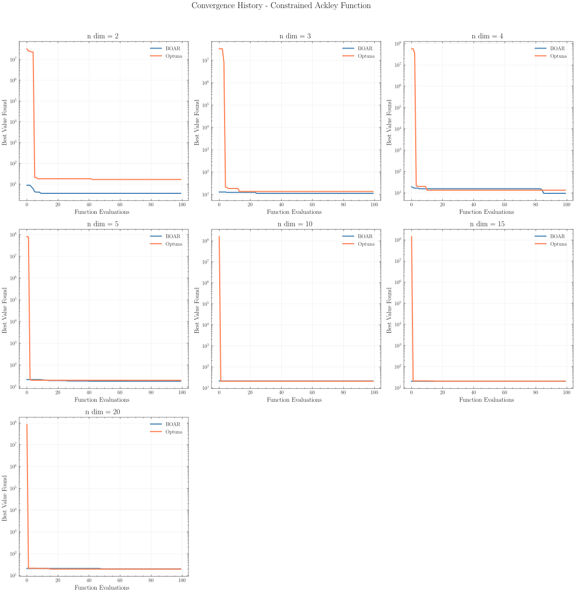

   **Figure 7:** BOAR optimization convergence on the constrained Ackley function.

.. figure:: _static/images/ackley_constrained/ackley_search_constrained_history.svg
   :width: 600
   :alt: Constrained Ackley search history

   **Figure 8:** Search history of BOAR optimization on the 2D constrained Ackley function.

Rosenbrock Function
-------------------

The Rosenbrock function is a non-convex function commonly used to test optimization algorithms.
It has many local minima but one global minimum.

Function Definition
~~~~~~~~~~~~~~~~~~~

.. math::

    f(x, y) = (a - x)^2 + b(y - x^2)^2

Properties
~~~~~~~~~~

+--------------------+----------------------------------------+
| Property           | Value                                  |
+====================+========================================+
| Global Minimum     | 0 at (1, 1)                            |
+--------------------+----------------------------------------+
| Search Domain      | Typically [-5, 10]                     |
+--------------------+----------------------------------------+
| Difficulty         | Narrow curved valley, hard to optimize |
+--------------------+----------------------------------------+

Optimization configurations (Rosenbrock)
~~~~~~~~~~~~~~~~~~~~~~~~~~~~~~~~~~~~~~~~

.. code-block:: yaml

    optimization_variable_options:
      'bounds': [!!python/tuple [-5, 10]]
      'precision': None
      'n_initial': 15

    surrogate_model_options:
      'max_tested_vectors': 100
      'tolerance': 1e-6
      'GPR_iterations': 500
      'test_population': 100000

    sampling_options:
      'seed': 9

Benchmark Results
~~~~~~~~~~~~~~~~~

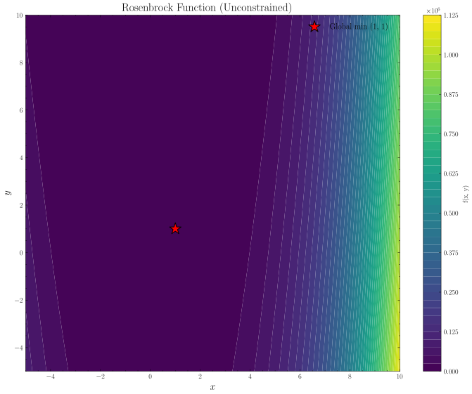

   **Figure 9:** Contour plot of the 2D Rosenbrock function showing global minimum at (1, 1).

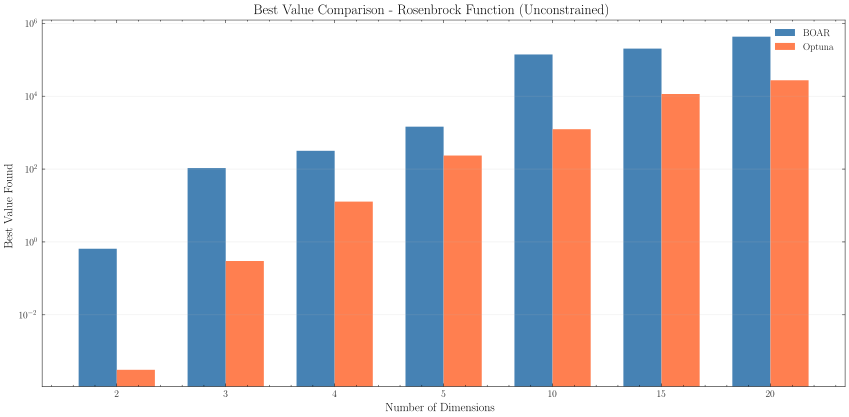

   **Figure 10:** Comparison of available BOAR optimization results on the Rosenbrock function.

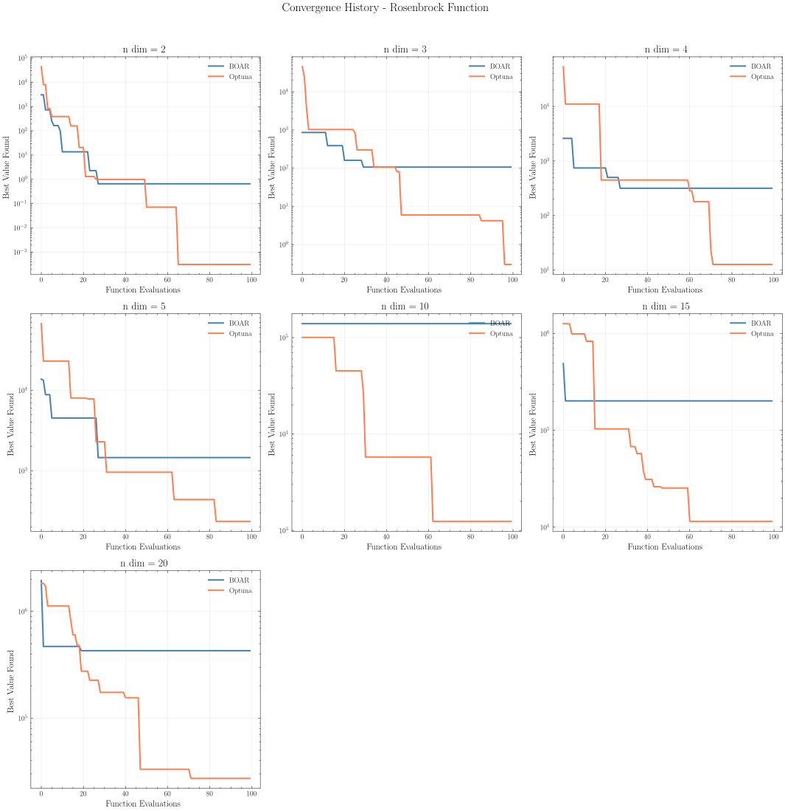

   **Figure 11:** BOAR optimization convergence on the Rosenbrock function.

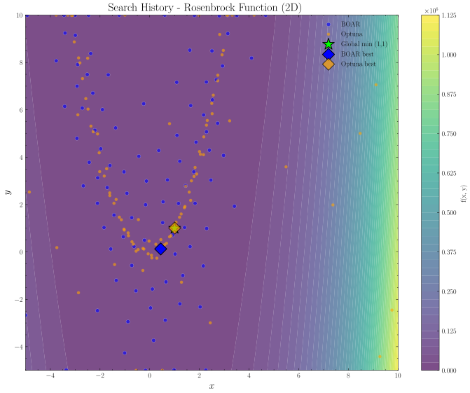

   **Figure 12:** Search history of BOAR optimization on the 2D Rosenbrock function.

Constrained version
~~~~~~~~~~~~~~~~~~~

The Rosenbrock function can also be tested with constraints, such as limiting the search space to a specific region or adding inequality constraints.
In this test case, we defined the following constraint:

.. math::

  g(\mathbf{x}) : \sum_{i=0}^{n-1} x_i^2 > n \cdot 5

This constraint defines a hypersphere where the feasible region is **outside** the sphere with radius :math:`\sqrt{5n}`.
The global minimum at :math:`\mathbf{x} = (1, 1, \ldots, 1)` lies inside the forbidden sphere, making this a challenging constrained optimization problem.

Equivalent logical form:

.. code-block:: python

  # For n_dim = 2:
  variables = ['x0', 'x1']
  expr = "x0**2 + x1**2 > 10"    # radius = sqrt(10) ≈ 3.16

  # For n_dim = 5:
  variables = ['x0', 'x1', 'x2', 'x3', 'x4']
  expr = "x0**2 + x1**2 + x2**2 + x3**2 + x4**2 > 25"    # radius = 5

  # For n_dim = 10:
  expr = "x0**2 + x1**2 + ... + x9**2 > 50"    # radius ≈ 7.07

Constrained Benchmark Results
~~~~~~~~~~~~~~~~~~~~~~~~~~~~~

The red dashed circle marks the constraint boundary :math:`x_0^2 + x_1^2 = 10`.
The shaded red region inside the circle is **infeasible** (inside the forbidden sphere).
The feasible region is the entire domain **outside** the circle.

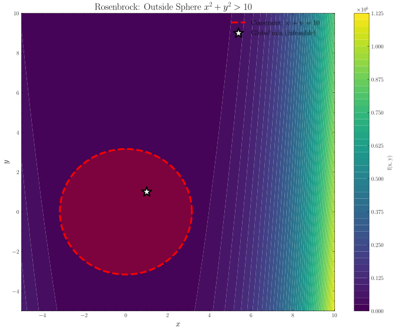

   **Figure 13:** Contour plot of the 2D constrained Rosenbrock function showing feasible region.

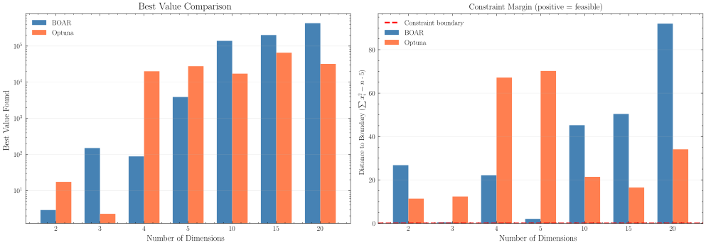

   **Figure 14:** Comparison of available BOAR optimization results on the constrained Rosenbrock function.

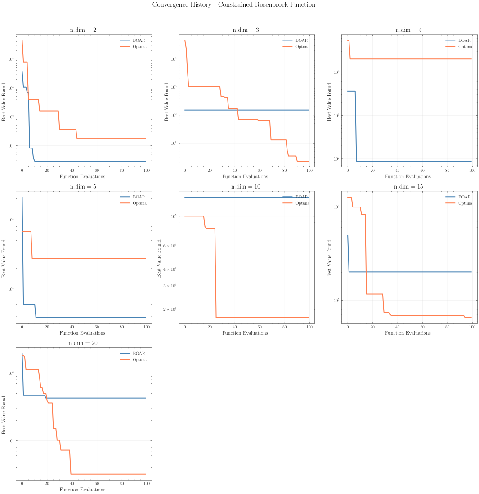

   **Figure 15:** BOAR optimization convergence on the constrained Rosenbrock function.

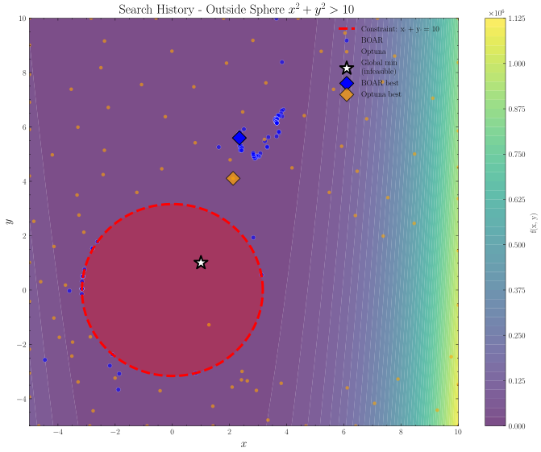

   **Figure 16:** Search history of BOAR optimization on the 2D constrained Rosenbrock function.
