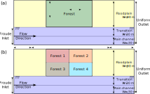
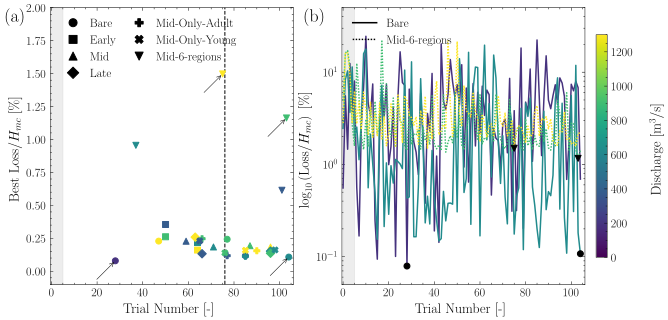
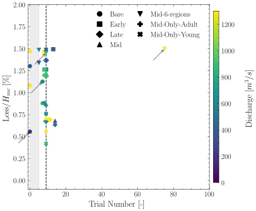

Benchmark Functions
===================

This page documents the benchmark tests used to validate the BOAR optimization framework.
Two classic optimization test functions are used: **Ackley** and **Rosenbrock**. Followed by a constrained version of each function to demonstrate the framework's ability to handle constraints.
Lastly a **BASEMENT** benchmark is included to demonstrate the framework's ability to handle a two-dimensional hydrodynamic models calibration.

.. contents::
   :local:

Ackley Function
---------------

The Ackley function is a non-convex function commonly used to test optimization algorithms.
It has many local minima but one global minimum.

Function Definition
~~~~~~~~~~~~~~~~~~~

.. math::

    f(x, y) = -20 \exp\left(-0.2 \sqrt{\frac{x^2 + y^2}{2}}\right) - \exp\left(\frac{\cos(2\pi x) + \cos(2\pi y)}{2}\right) + e + 20

Properties
~~~~~~~~~~

+--------------------+----------------------------------+
| Property           | Value                            |
+====================+==================================+
| Global Minimum     | 0 at (0, 0)                      |
+--------------------+----------------------------------+
| Search Domain      | [-32.768, 32.768]                |
+--------------------+----------------------------------+
| Difficulty         | Multi-modal, many local minima   |
+--------------------+----------------------------------+

Optimization configurations (Ackley)
~~~~~~~~~~~~~~~~~~~~~~~~~~~~~~~~~~~~

.. code-block:: yaml

    optimization_variable_options:
      'bounds': [!!python/tuple [-32.768, 32.768]]
      'precision': None
      'n_initial': 15

    surrogate_model_options:
      'max_tested_vectors': 100
      'tolerance': 1e-6
      'GPR_iterations': 500
      'test_population': 100000

    sampling_options:
      'seed': 9

Benchmark Results
~~~~~~~~~~~~~~~~~

.. figure:: _static/images/ackley_benchmark/ackley_contour.svg
   :width: 600
   :alt: Ackley function contour plot

   **Figure 1:** Contour plot of the 2D Ackley function showing global minimum at center.

.. figure:: _static/images/ackley_benchmark/ackley_comparison.svg
   :width: 600
   :alt: Ackley optimization comparison

   **Figure 2:** Comparison of available BOAR optimization results on the Ackley function.

.. figure:: _static/images/ackley_benchmark/ackley_convergence.svg
   :width: 600
   :alt: Ackley optimization convergence

   **Figure 3:** BOAR optimization convergence on the Ackley function.

.. figure:: _static/images/ackley_benchmark/ackley_search_history.svg
   :width: 600
   :alt: Ackley search history

   **Figure 4:** Search history of BOAR optimization on the 2D Ackley function.

Constrained version
~~~~~~~~~~~~~~~~~~~

The Ackley function can also be tested with constraints, such as limiting the search space to a specific region or adding inequality constraints.
In this test case, we defined the following constraint:

.. math::

    g(x, y) = x_i + x_{i+1} + \ldots + x_n \leq 0

This constraint limits the sum of the optimization variables, creating a more challenging optimization problem.

Constrained Benchmark Results
~~~~~~~~~~~~~~~~~~~~~~~~~~~~~

.. figure:: _static/images/ackley_constrained/ackley_constrained_contour.svg
   :width: 600
   :alt: Ackley function contour plot with constraints

   **Figure 5:** Contour plot of the 2D constrained Ackley function showing feasible region.

.. figure:: _static/images/ackley_constrained/ackley_constrained_comparison.svg
   :width: 600
   :alt: Constrained Ackley optimization comparison

   **Figure 6:** Comparison of available BOAR optimization results on the constrained Ackley function.

.. figure:: _static/images/ackley_constrained/ackley_constrained_convergence.svg
   :width: 600
   :alt: Constrained Ackley optimization convergence

   **Figure 7:** BOAR optimization convergence on the constrained Ackley function.

.. figure:: _static/images/ackley_constrained/ackley_search_constrained_history.svg
   :width: 600
   :alt: Constrained Ackley search history

   **Figure 8:** Search history of BOAR optimization on the 2D constrained Ackley function.

Rosenbrock Function
-------------------

The Rosenbrock function is a non-convex function commonly used to test optimization algorithms.
It has many local minima but one global minimum.

Function Definition
~~~~~~~~~~~~~~~~~~~

.. math::

    f(x, y) = (a - x)^2 + b(y - x^2)^2

Properties
~~~~~~~~~~

+--------------------+----------------------------------------+
| Property           | Value                                  |
+====================+========================================+
| Global Minimum     | 0 at (1, 1)                            |
+--------------------+----------------------------------------+
| Search Domain      | Typically [-5, 10]                     |
+--------------------+----------------------------------------+
| Difficulty         | Narrow curved valley, hard to optimize |
+--------------------+----------------------------------------+

Optimization configurations (Rosenbrock)
~~~~~~~~~~~~~~~~~~~~~~~~~~~~~~~~~~~~~~~~

.. code-block:: yaml

    optimization_variable_options:
      'bounds': [!!python/tuple [-5, 10]]
      'precision': None
      'n_initial': 15

    surrogate_model_options:
      'max_tested_vectors': 100
      'tolerance': 1e-6
      'GPR_iterations': 500
      'test_population': 100000

    sampling_options:
      'seed': 9

Benchmark Results
~~~~~~~~~~~~~~~~~

.. figure:: _static/images/rosenbrock/rosenbrock_contour.svg
   :width: 600
   :alt: Rosenbrock function contour plot

   **Figure 9:** Contour plot of the 2D Rosenbrock function showing global minimum at (1, 1).

.. figure:: _static/images/rosenbrock/rosenbrock_comparison.svg
   :width: 600
   :alt: Rosenbrock optimization comparison

   **Figure 10:** Comparison of available BOAR optimization results on the Rosenbrock function.

.. figure:: _static/images/rosenbrock/rosenbrock_convergence.svg
   :width: 600
   :alt: Rosenbrock optimization convergence

   **Figure 11:** BOAR optimization convergence on the Rosenbrock function.

.. figure:: _static/images/rosenbrock/rosenbrock_search_history.svg
   :width: 600
   :alt: Rosenbrock search history

   **Figure 12:** Search history of BOAR optimization on the 2D Rosenbrock function.

Constrained version
~~~~~~~~~~~~~~~~~~~

The Rosenbrock function can also be tested with constraints, such as limiting the search space to a specific region or adding inequality constraints.
In this test case, we defined the following constraint:

.. math::

  g(\mathbf{x}) : \sum_{i=0}^{n-1} x_i^2 > n \cdot 5

This constraint defines a hypersphere where the feasible region is **outside** the sphere with radius :math:`\sqrt{5n}`.
The global minimum at :math:`\mathbf{x} = (1, 1, \ldots, 1)` lies inside the forbidden sphere, making this a challenging constrained optimization problem.

Equivalent logical form:

.. code-block:: python

  # For n_dim = 2:
  variables = ['x0', 'x1']
  expr = "x0**2 + x1**2 > 10"    # radius = sqrt(10) ≈ 3.16

  # For n_dim = 5:
  variables = ['x0', 'x1', 'x2', 'x3', 'x4']
  expr = "x0**2 + x1**2 + x2**2 + x3**2 + x4**2 > 25"    # radius = 5

  # For n_dim = 10:
  expr = "x0**2 + x1**2 + ... + x9**2 > 50"    # radius ≈ 7.07

Constrained Benchmark Results
~~~~~~~~~~~~~~~~~~~~~~~~~~~~~

The red dashed circle marks the constraint boundary :math:`x_0^2 + x_1^2 = 10`.
The shaded red region inside the circle is **infeasible** (inside the forbidden sphere).
The feasible region is the entire domain **outside** the circle.

.. figure:: _static/images/rosenbrock_constrained/rosenbrock_constrained_contour.svg
   :width: 600
   :alt: Rosenbrock function contour plot with constraints

   **Figure 13:** Contour plot of the 2D constrained Rosenbrock function showing feasible region.

.. figure:: _static/images/rosenbrock_constrained/rosenbrock_constrained_comparison.svg
   :width: 600
   :alt: Constrained Rosenbrock optimization comparison

   **Figure 14:** Comparison of available BOAR optimization results on the constrained Rosenbrock function.

.. figure:: _static/images/rosenbrock_constrained/rosenbrock_constrained_convergence.svg
   :width: 600
   :alt: Constrained Rosenbrock optimization convergence

   **Figure 15:** BOAR optimization convergence on the constrained Rosenbrock function.

.. figure:: _static/images/rosenbrock_constrained/rosenbrock_search_constrained_history.svg
   :width: 600
   :alt: Constrained Rosenbrock search history

   **Figure 16:** Search history of BOAR optimization on the 2D constrained Rosenbrock function.

Compound Channel Benchmark (BASEMENT v4.2)
------------------------------------------

A compound channel benchmark is included to demonstrate the framework's ability to handle a two-dimensional hydrodynamic models calibration. The compound channel was divided into three friction zones (main channel, floodplain, and floodplain forest), each with a different Strickler's roughness coefficient (Figure 17). The search space for the optimization had 1 dimension (overbank flow), 2 dimensions (main channel and floodplain), 3 dimensions (main channel, floodplain, and floodplain forest), and additional 6-dimensional case was considered, at which the floodplain forest was divided into 4 zones.
The goal of the optimization is to calibrate these coefficients to match observed water levels and flow rates.

   **Figure 17:** Numerical simulations domain and boundary conditions. (a) For all Bare and Forest scenarions, and (b) artificial dim = 6 scenario  applied to the Mid vegetation. Each colour represents a hydraulic roughness region

The loss is computed in terms of the Root Mean Square Error (RMSE) between the observed and simulated water levels and flow rates, normalized by the main channel flow depth. The following conditions were used for the optimization:

.. code-block:: yaml

    optimization_variable_options:
      'bounds': [!!python/tuple [20, 60], !!python/tuple [20, 60], !!python/tuple [10, 35]] # Main channel, Floodplain, Floodplain Forest
      'constraints':
        'expression': "z < x and z < y"  # Floodplain Forest < Main channel and Floodplain
        'variables': ['x', 'y', 'z']
      'precision': 0.1
      'n_initial': 5

    surrogate_model_options:
      'max_tested_vectors': 100
      'max_no_improvement': 100
      'tolerance': 1e-4
      'GPR_iterations': 500
      'test_population': 80200

    sampling_options:
      'seed': 9

The following results were obtained for the BASEMENT benchmark using the BOAR engine:

   **Figure 18:** Calibration-convergence analysis based on the normalized :math:`\mathrm{RMSE}/H_{mc}`: (a) best loss value (%) versus trial number; (b) loss-value trajectories for the *Bare* and *Early* cases at the trials highlighted by arrows in panel (a). The dashed line in panel (a) denotes the median number of trials required to obtain the optimal loss, and the black markers in panel (b) indicate the corresponding optimal solution. The shaded light gray area represents the initial training phase. All simulations were performed on a Froude-scaled model at a 1:1 prototype scale.

Note that the convergence is highly tied to the desired tolerance. For instance, if the tolerance is increased to 1.5%, the convergence is achieved in fewer trials (median = 9 trials), as shown in Figure 19.

   **Figure 19:** Calibration-convergence analysis based on the normalized :math:`\mathrm{RMSE}/H_{mc}` (Loss) versus trial number, with an error threshold of :math:`\mathrm{Loss}/H_{mc} \leq 1.5\%`. The shaded light gray area represents the initial training phase. All simulations were performed on a Froude-scaled model at a 1:1 prototype scale.

For a more in depth information about the compound channel benchmark, please check de Oliveira et al. (2026) [1]_.

References
----------

.. [1] LED. de Oliveira, MJ. Franca, NP. Huber, D. Vanzo, *BOAR: Bayesian Optimization for Automated Roughness calibration in two-dimensional hydrodynamic models*. SoftwareX, (under review)
